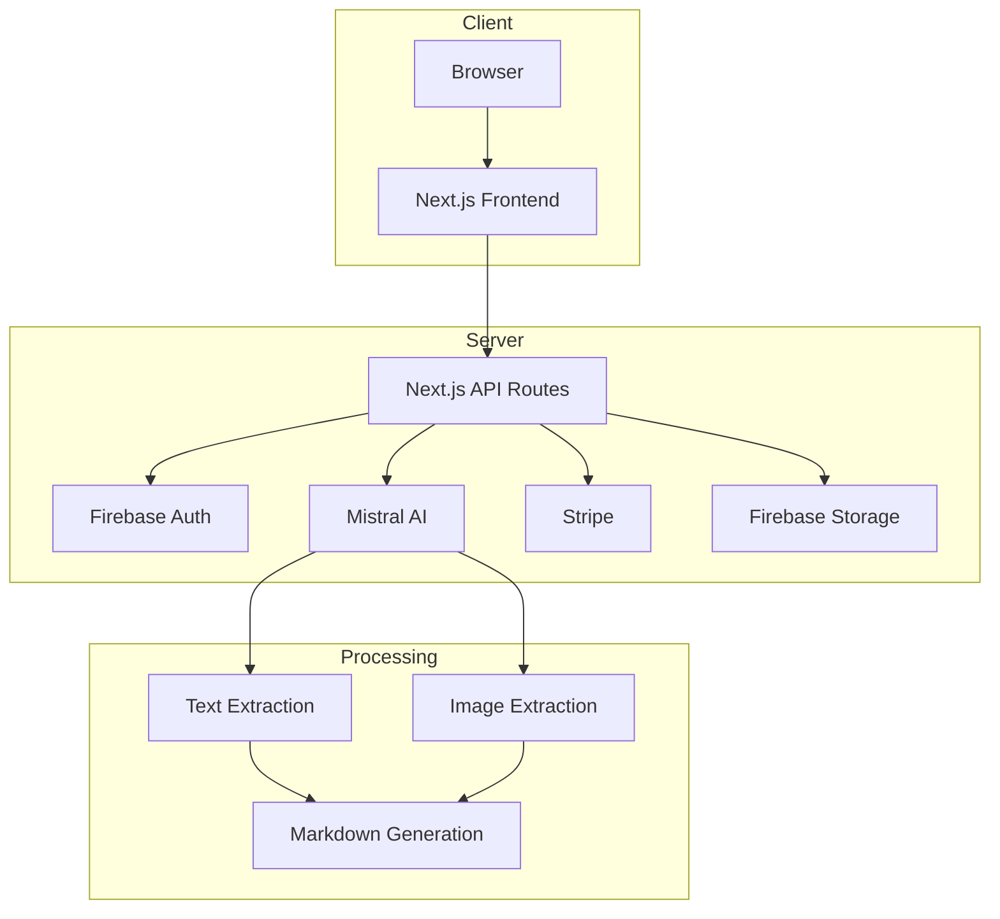
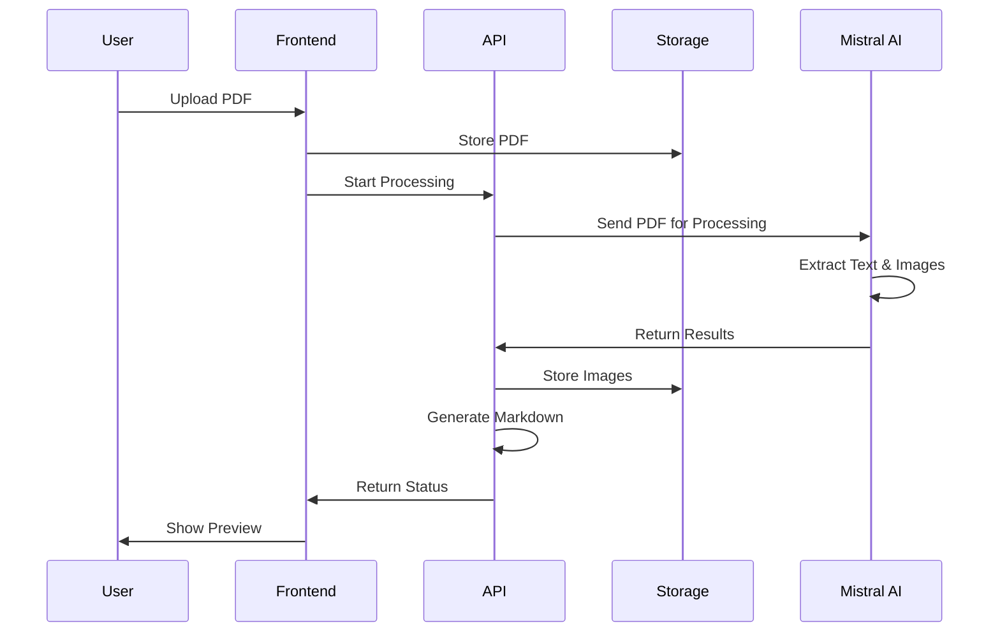

# Architecture for PDF2MD

Status: Approved

## Technical Summary

PDF2MD is built using Next.js 14 with the App Router, leveraging React server components for optimal performance and SEO. The application uses Firebase for authentication and file storage, Mistral AI for PDF processing and OCR, and Stripe for payment processing. The architecture follows a modern, serverless approach with API routes handling the core business logic and real-time processing status updates.

## Technology Table

| Technology | Version | Purpose | Description |
|------------|---------|---------|-------------|
| Next.js | 14.x | Frontend & Backend | React framework with App Router for server-side rendering |
| React | 18.x | UI Components | Frontend library for building user interfaces |
| TypeScript | 5.x | Development | Type-safe programming language |
| Tailwind CSS | 3.x | Styling | Utility-first CSS framework |
| Firebase Auth | 10.x | Authentication | User authentication and session management |
| Firebase Storage | 10.x | File Storage | Temporary storage for PDFs and extracted images |
| Mistral AI | Latest | AI Processing | PDF text extraction and OCR processing |
| Stripe | Latest | Payments | Subscription and payment processing |

## Architectural Diagrams

### High-Level System Architecture



### PDF Processing Flow



## Data Models

### User Model
```typescript
interface User {
  uid: string;
  email: string;
  subscription: {
    tier: 'free' | 'pro' | 'enterprise';
    status: 'active' | 'cancelled' | 'past_due';
    validUntil: Date;
  };
  usage: {
    conversionsThisMonth: number;
    totalStorage: number; // in bytes
  };
  createdAt: Date;
  updatedAt: Date;
}
```

### Conversion Job Model
```typescript
interface ConversionJob {
  jobId: string;
  userId: string;
  status: 'pending' | 'processing' | 'completed' | 'failed';
  inputFile: {
    name: string;
    size: number;
    path: string;
  };
  output: {
    markdown: string;
    images: Array<{
      name: string;
      path: string;
      size: number;
    }>;
  };
  error?: string;
  createdAt: Date;
  completedAt?: Date;
}
```

## Project Structure

```text
src/
├── app/
│   ├── api/                    # API Routes
│   │   ├── auth/              # Authentication endpoints
│   │   ├── convert/           # PDF conversion endpoints
│   │   ├── subscription/      # Subscription management
│   │   └── webhook/           # Stripe webhooks
│   ├── (auth)/                # Auth-required routes
│   │   ├── dashboard/         # User dashboard
│   │   └── settings/          # User settings
│   ├── components/            # React Components
│   │   ├── ui/               # UI components
│   │   ├── forms/            # Form components
│   │   └── conversion/       # Conversion-related components
│   └── lib/                  # Utility functions
│       ├── firebase/         # Firebase config & utils
│       ├── mistral/          # Mistral AI integration
│       └── stripe/           # Stripe integration
├── types/                    # TypeScript types
└── config/                   # Configuration files
```

## Infrastructure

The application is deployed on Vercel's Edge Network, providing:
- Global CDN distribution
- Automatic HTTPS
- Edge Functions for API routes
- Zero-downtime deployments

Firebase provides:
- Authentication
- File storage with automatic cleanup
- Usage monitoring

## Deployment Plan

1. Development Environment
   - Local development with environment variables
   - Firebase emulator for auth and storage
   - Stripe test mode

2. Staging Environment
   - Vercel Preview Deployments
   - Test Firebase project
   - Stripe test mode

3. Production Environment
   - Vercel Production Deployment
   - Production Firebase project
   - Stripe live mode
   - Domain setup with custom SSL

## Change Log

| Change | Date | Description |
|--------|------|-------------|
| Initial Draft | N/A | Initial architecture document | 