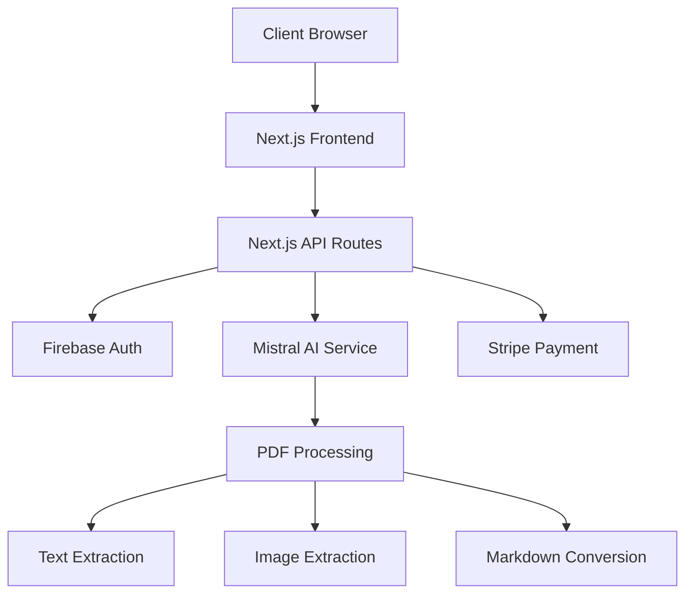

# 1. Title: PRD for PDF2MD

<version>1.0.0</version>

## Status: Approved

## Intro

PDF2MD is a web application designed to convert PDF documents into well-formatted Markdown files. It leverages Mistral AI for high-accuracy text extraction and includes advanced features for image extraction, making it particularly suitable for users of note-taking applications like Obsidian. The service offers tiered subscription plans to accommodate different usage needs and feature requirements.

## Goals

- Create a user-friendly web application for converting PDFs to Markdown
- Achieve >95% accuracy in text extraction and formatting preservation
- Support automatic image extraction and proper referencing in Markdown
- Implement tiered subscription model with clear value propositions
- Ensure Obsidian-compatible output format
- Process PDFs quickly and efficiently (target: <30s for standard documents)

## Features and Requirements

### Functional Requirements
- PDF upload via drag-and-drop or file selector
- AI-powered OCR text extraction
- Automatic image extraction and saving
- Markdown preview and editing
- Download converted Markdown and images
- User authentication and account management
- Subscription management and billing
- Usage tracking and limits

### Non-functional Requirements
- Performance: <30s processing time for standard documents
- Security: Secure file handling and user data protection
- Scalability: Support concurrent user processing
- Reliability: 99.9% uptime for the service
- Accessibility: WCAG 2.1 AA compliance

### User Experience Requirements
- Intuitive drag-and-drop interface
- Real-time conversion progress feedback
- Live Markdown preview
- Mobile-responsive design
- Clear subscription tier comparison
- Easy subscription management

### Integration Requirements
- Firebase Authentication
- Stripe payment processing
- Mistral AI integration for text processing and OCR
- Cloud storage for temporary file handling

## Epic List

### Epic-1: Core PDF Processing
- PDF upload and validation
- Text extraction and processing
- Image extraction and handling
- Markdown conversion and formatting

### Epic-2: User Interface
- Landing page and navigation
- File upload interface
- Preview and editing interface
- Subscription management interface

### Epic-3: Authentication and Billing
- User authentication flow
- Subscription tiers implementation
- Payment processing
- Usage tracking and limits

### Epic-N: Future Enhancements
- Batch processing
- Cloud storage integration
- API access
- Direct Obsidian integration
- Advanced formatting options

## Epic 1: Story List

- Story 1: PDF Upload System
  Status: ''
  Requirements:
  - Implement drag-and-drop file upload
  - Add file type and size validation
  - Create progress indicator
  - Setup temporary storage

- Story 2: PDF Processing Engine
  Status: ''
  Requirements:
  - Integrate AI OCR service
  - Implement text extraction
  - Setup image extraction
  - Create Markdown conversion logic

## Technology Stack

| Technology | Description |
| ------------ | ------------------------------------------------------------- |
| Next.js 14 | React framework for the frontend and API routes |
| React | Frontend UI library |
| Tailwind CSS | Utility-first CSS framework |
| Firebase | Authentication and file storage |
| Stripe | Payment processing and subscription management |
| Mistral AI | AI service for text processing and OCR |

## Reference

### System Architecture



## Data Models

### User Schema
```json
{
  "uid": "string",
  "email": "string",
  "subscription": {
    "tier": "string",
    "status": "string",
    "validUntil": "datetime"
  },
  "usage": {
    "conversionsThisMonth": "number",
    "totalStorage": "number"
  }
}
```

### Conversion Job Schema
```json
{
  "jobId": "string",
  "userId": "string",
  "status": "string",
  "inputFile": "string",
  "outputMarkdown": "string",
  "images": ["string"],
  "createdAt": "datetime",
  "completedAt": "datetime"
}
```

## Project Structure

```text
src/
├── app/
│   ├── api/           # API routes
│   ├── components/    # React components
│   ├── lib/          # Utility functions
│   └── subscription/ # Subscription management
├── types/            # TypeScript types
└── config/          # Configuration files
```

## Change Log

| Change | Story ID | Description |
| -------- | -------- | ----------- |
| Initial draft | N/A | Initial PRD draft | 