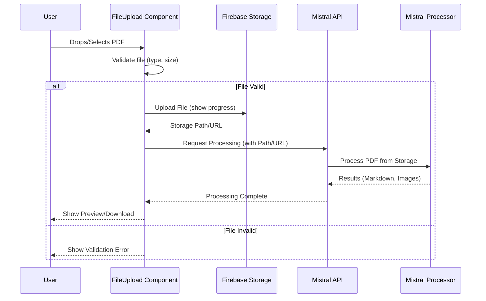

# Epic-1 - Story-1
# Implement PDF Upload System

**As a** user
**I want** to upload PDF files through a drag-and-drop interface or file selector
**so that** I can convert them to Markdown format

## Status

In Progress

## Context

This story implements the PDF upload functionality using a client-side approach. The existing `FileUpload.tsx` component will be enhanced to include drag-and-drop, explicit size validation, and direct upload to Firebase Storage before triggering the OCR process.

- **Previous State:** Basic project structure, Firebase config, and `FileUpload` component existed but lacked drag-and-drop, proper validation, and client-side upload logic.

## Estimation

Story Points: 1 (Refinement of existing component)

## Tasks

1. - [x] ~~Project Setup~~
   1. - [x] ~~Initialize Next.js 14 project with TypeScript~~
   2. - [x] ~~Configure Tailwind CSS~~
   3. - [x] ~~Set up ESLint and Prettier~~
   4. - [x] ~~Create basic project structure~~

2. - [x] ~~Firebase Integration~~
   1. - [x] ~~Set up Firebase project~~
   2. - [x] ~~Configure Firebase Storage~~
   3. - [x] ~~Create Firebase configuration file~~
   4. - [x] ~~Implement storage utility functions~~

3. - [x] ~~Refine `FileUpload.tsx`~~
   1. - [x] ~~Implement drag-and-drop event handlers (`onDragOver`, `onDrop`).~~
   2. - [x] ~~Add explicit file size validation (<= 50MB).~~
   3. - [x] ~~Implement visual feedback for drag-over state.~~
   4. - [x] ~~Implement upload progress indicator (using Firebase upload task).~~
   5. - [x] ~~Integrate `uploadFile` utility for client-side upload.~~
   6. - [x] ~~Modify component state to handle upload status separately from processing.~~
   7. - [x] ~~Pass the Firebase Storage URL/path to `MistralOCRProcessor` instead of the File object.~~

4. - [x] ~~API Implementation~~ (Handled by `MistralOCRProcessor` and its API route)

5. - [x] ~~Testing~~
   1. - [x] ~~Write/update component tests for `FileUpload.tsx` (drag-and-drop, validation, upload flow).~~
   2. - [x] ~~Write API tests~~
   3. - [x] ~~Write storage utility tests~~

## Constraints

- Maximum file size: 50MB (50 * 1024 * 1024 bytes)
- Accepted file types: .pdf only
- Temporary storage duration: 24 hours (Configure via Firebase rules if needed)
- Must work across all modern browsers
- Must be mobile-responsive

## Data Models / Schema

```typescript
interface UploadConfig {
  maxSize: number;
  allowedTypes: string[];
  storagePrefix: string;
}

interface UploadResponse {
  success: boolean;
  fileId?: string;
  error?: string;
  url?: string;
}

interface UploadProgress {
  progress: number; // 0-100
  status: 'idle' | 'validating' | 'uploading' | 'processing' | 'complete' | 'error';
  message?: string;
  uploadSpeed?: string; // e.g., '1.2 MB/s'
}

// Updated FileUpload component state might include:
interface FileUploadState {
  file: File | null;
  uploadStatus: UploadProgress['status'];
  uploadProgress: number;
  storagePath: string | null;
  markdownResult: string | null;
  // ... other states
}
```

## Structure

```text
src/
├── components/
│   └── FileUpload.tsx       # Main upload component (to be modified)
│   └── MistralOCRProcessor.tsx # Handles OCR processing (input changed)
├── lib/
│   └── firebase/
│       ├── config.ts           # Firebase configuration
│       └── storage.ts          # Storage utility functions (to be used)
└── app/
    └── api/
        └── mistral/           # API for Mistral processing
```

## Diagrams

### Updated Upload Flow (Client-Side)



## Dev Notes

- Update `MistralOCRProcessor` props to accept `storagePath` or `fileUrl` instead of `File`.
- Ensure Firebase Storage rules allow client-side uploads (potentially restricted by user auth UID).
- Handle potential errors during the upload process gracefully.

## Chat Command Log

- User: alot of things are already setup can you check the entrire codebase to see what we need to add
- Agent: Analyzed codebase, identified existing setup, proposed revised plan.
- User: Option A
- Agent: Updated story-1.story.md for client-side upload. 