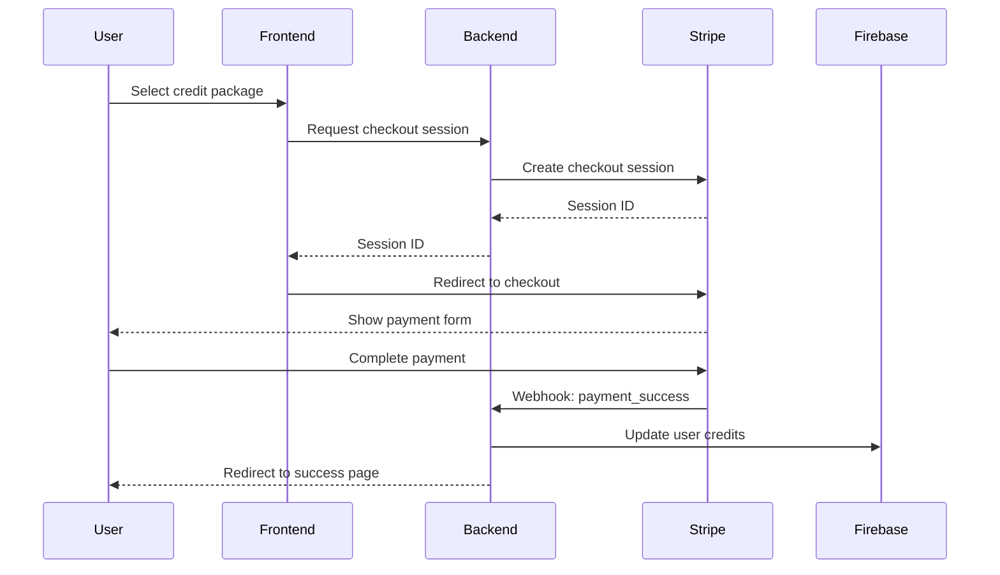

# Epic-1 - Story-2
# Implement Stripe Payment System

**As a** user
**I want** to purchase page credits for PDF conversion
**so that** I can convert larger documents and use the service more extensively

## Status

In Progress

## Context

This story implements the Stripe payment system to allow users to purchase page credits for PDF conversion. We'll use Stripe's modern payment elements and customer portal for subscription management.

- **Previous State:** Basic PDF upload and conversion functionality exists, with a simple page credit system.
- **Integration Points:** Will integrate with existing AuthContext and user management system.

## Estimation

Story Points: 2 (New feature with external integration)

## Tasks

1. - [x] ~~Stripe Setup~~
   1. - [x] ~~Set up Stripe account and get API keys~~
   2. - [x] ~~Configure Stripe products and prices for different credit packages~~
   3. - [x] ~~Set up webhook endpoints for payment events~~

2. - [x] ~~Backend Implementation~~
   1. - [x] ~~Create Stripe customer creation/management API~~
   2. - [x] ~~Implement webhook handler for payment events~~
   3. - [x] ~~Create API endpoints for:~~
      - ~~Checkout session creation~~
      - ~~Customer portal session~~
      - ~~Credit balance checking~~
      - ~~Payment history~~
   4. - [x] ~~Set up credit management system in Firebase~~

3. - [ ] Frontend Implementation
   1. - [x] ~~Create PricingPlans component~~
   2. - [x] ~~Implement Stripe Elements integration~~
   3. - [x] ~~Add credit balance display in header/dashboard~~
   4. - [x] ~~Create payment history view~~
   5. - [x] ~~Add subscription management portal access~~

4. - [ ] Testing
   1. - [ ] Test payment flow with Stripe test cards
   2. - [ ] Test webhook handling
   3. - [ ] Test credit system
   4. - [ ] Test error scenarios

## Constraints

- Must use Stripe's latest API version
- Must implement proper error handling for failed payments
- Must handle webhook events idempotently
- Must secure API endpoints with proper authentication
- Must comply with Stripe's terms of service and security requirements

## Data Models / Schema

```typescript
interface CreditPackage {
  id: string;
  name: string;
  credits: number;
  price: number;
  stripePriceId: string;
}

interface UserCredits {
  userId: string;
  balance: number;
  lastUpdated: Timestamp;
}

interface PaymentHistory {
  userId: string;
  transactionId: string;
  amount: number;
  credits: number;
  status: 'succeeded' | 'failed' | 'refunded';
  createdAt: Timestamp;
}
```

## Structure

```text
src/
├── components/
│   ├── PricingPlans.tsx      # Display pricing options
│   ├── CheckoutButton.tsx    # Handle checkout flow
│   └── PaymentHistory.tsx    # Display payment history
├── lib/
│   ├── stripe/
│   │   ├── config.ts         # Stripe configuration
│   │   └── client.ts         # Stripe client utilities
│   └── firebase/
│       └── credits.ts        # Credit management functions
└── app/
    └── api/
        └── stripe/
            ├── checkout/route.ts     # Create checkout sessions
            ├── portal/route.ts       # Customer portal sessions
            └── webhook/route.ts      # Handle Stripe webhooks
```

## Diagrams

### Payment Flow



## Dev Notes

- Use Stripe's test mode for development
- Implement proper error handling and recovery
- Use Stripe's webhook signing for security
- Consider implementing automatic retries for failed credit updates
- Cache credit balance and update optimistically
- Use Firebase transactions for credit updates

## Chat Command Log

- User: I need help sorting out the payment systems now using stripe
- Agent: Created story-2.story.md for Stripe implementation plan 